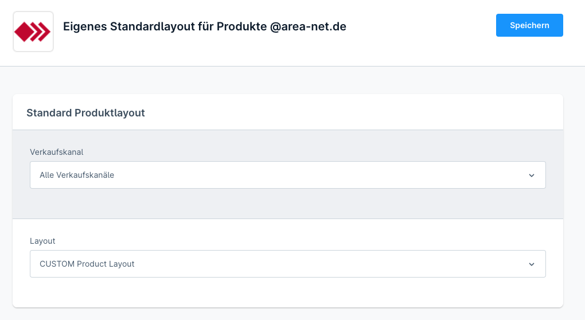

# Benutzerdefiniertes Standard Produktlayout für Shopware 6

Mit diesem kleinen Plugin kannst du das Standard Produktlayout in Shopware 6 ändern. Gehe dazu einfach in die Pluginkonfiguration uns setze dein gewünschtes Produktlayout als Standard. 

Ab diesem Zeitpunkt wird dieses Produktlayout und nicht das von Shopware definierte als Standard verwendet.

## Customized standard product layout for Shopware 6

With this small plugin you can change the default product layout in Shopware 6. Simply go to the plugin configuration and set your desired product layout as the default.

From this point on, this product layout and not the one defined by Shopware will be used as the default.

## Version info and download

- **Version 1.**: Shopware 6.4
- **Version 2.**: Shopware 6.5

[Download Releases](https://github.com/AREA-NET-GmbH-Shopware-Agentur/plugin-default-product-layout/releases)

## Screenshot

___

## Changelog

### [1.0.0 / 2.0.0] - 2024-02-16

- Inital implementation, set default layout for products in plugin config

___

## Shopware Theme und Plugins

Neben kostenlosen Open-Source Shopware-Plugins bietet die Shopware-Agentur auch Themes und Plugins im Shopware-Store an:

- [A Better CMS Theme](https://store.shopware.com/en/arean62788672693m/a-better-cms-theme-optimized-checkout-b2b-functions-flexibly-customizable.html) mit optimiertem Checkout
- [A Better CMS Elements](https://store.shopware.com/arean13931131788m/a-better-cms-elements-slider-bilder-html5-video-google-maps-vorher-nachher-bilder.html) mit umfangreichen Erweiterungen der Standard-Inhaltselemente
- [Pagespeed Booster](https://store.shopware.com/arean41766445685m/pagespeed-booster-paypal-und-externe-skripte-auf-der-startseite-deaktivieren.html) deaktiviert PayPal und Co. auf der Startseite
- [Optimierte Inhaltsbearbeitung](https://store.shopware.com/arean36129443353f/optimierte-inhaltsbearbeitung-inhalte-nur-im-designer-bearbeiten-inhalte-in-layout-uebertragen.html) für CMS-Seiten und Kategorien
- [HTTP-Auth](https://store.shopware.com/arean97586892435f/http-authentifizierung-fuer-verkaufskanaele.html) für Verkaufskanäle

## AREA-NET GmbH
Die AREA-NET GmbH ist Shopware Partner Agentur und Shopware Hersteller, sowie Pickware Partner aus dem Großraum Stuttgart in Baden-Württemberg/Deutschland. 

**Adresse**\
Öschstrasse 33\
73072 Donzdorf

Telefon: +49 (0)7162 - 941140\
Mail: [info@area-net.de](mailto:info@area-net.de)\
Web: [www.area-net.de](https://www.area-net)

Mehr Informationen, Projektanfragen und Support gibt es auf der Website der [Shopware-Agentur AREA-NET GmbH](https://www.area-net.de).

**Follow us**

- https://linkedin.com/companyarea-net-gmbh-shopware-agentur
- https://www.facebook.com/area.net.gmbh

